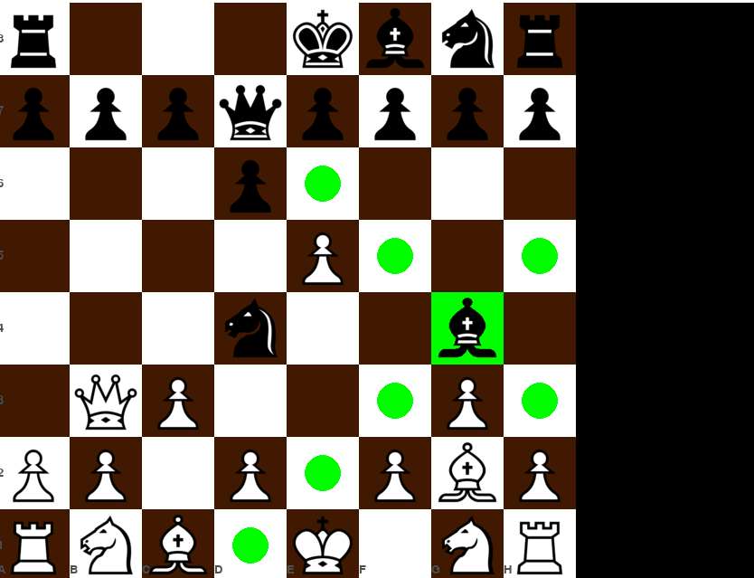

# ChessII
____
## Механики в плане
### Очень важно
- Приведение пешки к краю доски и ее превращение в другую фигуру :white_check_mark: 29.04
- Взятие на проходе 
- Обучение нейронной сети по алгоритму Soft Actor-Critic https://spinningup.openai.com/en/latest/algorithms/sac.html
### Во время обучения можно заняться
- Стэком ходов для операции отмены
- Анализ позиции путем натравливания на нее нейронки
- Ход партии в виде истории в человеческом виде по типу "E2-E4"
____
## Текущее состояние
